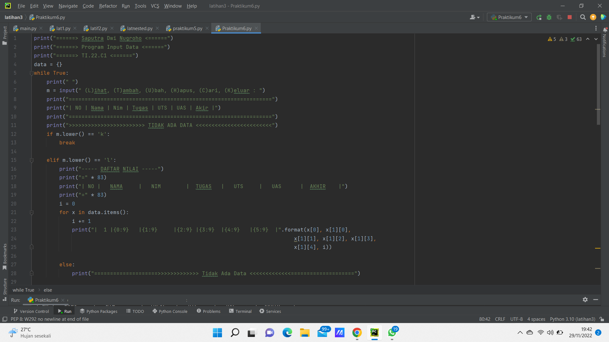

## Praktikum 6
## Tugas Praktikum
Buat program sederhana yang akan menampilkan daftar nilai mahasiswa, dengan ketentuan: - Program dibuat dengan menggunakan DICTIONARY - Tampilkan menu pilihan : (Tambah Data, Ubah Data, Hapus Data, Tampilkan Data, Cari Data) - Nilai Akhir diambil dari perhitungan 3 komponen nilai(tugas:30%, UTS:35%, UAS:35%) - Buat Flowchart dan penjelasan programnya pada README.md - Commit dan push repository ke github.

## Langkah - Langkah Program :
print("======> Saputra Dwi Nugroho <======") print("======> Program Input Data <======") print("======> TI.22.C1 <======") data = {} while True: print("") m = input(" (L)ihat, (T)ambah, (U)bah, (H)apus, (C)ari, (K)eluar : ") print("================================================================") print("| NO | Nama | Nim | Tugas | UTS | UAS | Akir |") print("================================================================") print(">>>>>>>>>>>>>>>>>>>>>>>> TIDAK ADA DATA <<<<<<<<<<<<<<<<<<<<<<<<") if m.lower() == 'k': break
elif m.lower() == 'l':
    print("----- DAFTAR NILAI -----")
    print("="*83)
    print("| NO |   NAMA     |   NIM        |  TUGAS   |   UTS     |   UAS      |  AKHIR    |")
    print("="*83)
    i = 0
    for x in data.items():
        i += 1
        print("|  1 |{0:9}   |{1:9}     |{2:9} |{3:9}  |{4:9}   |{5:9}  |" .format(x[0], x[1][0],
                                                                                   x[1][1], x[1][2], x[1][3],
                                                                                   x[1][4], i))

    else:
        print("====================>>>>>>>>>>>>> Tidak Ada Data <<<<<<<<<<<<<====================")

elif m.lower() == 't':
    print("--------------- Tambah Data ---------------")
    nama = input("Nama                  : ")
    nim = input("Nim                   : ")
    tugas = float(input("Masukan Nilai Tugas   : "))
    uts = float(input("Masukan Nilai UTS     : "))
    uas = float(input("Masukan Nilai UAS     : "))
    akhir = (int(tugas) * .30) + (int(uts) * .35) + (int(uas) * .35)
    data[nama] = nim, tugas, uts, uas, akhir

elif m.lower() == 'u':
    print("----- Ubah Data Mahasiswa -----")
    nama = input("Nama  : ")
    if nama in data.keys():
        nim = input("Nim : ")
        tugas = float(input("masukan nilai tugas : "))
        uts = float(input("masukan nilai Uts : "))
        uas = float(input("masukan nilai uas : "))
        akhir = (int(tugas) * .30) + (int(uts) * .35) + (int(uas) * .35)
        data[nama] = nim, tugas, uts, uas, akhir

    else:
        print("Tidak Ada data")

elif m.lower() == 'h':
    print("Hapus Data Mahasiswa")
    nama = input("nama : ")
    if nama in data.keys():
        print("Datanya", nama, "adalah {0}".format(data[nama]))
    else:
        print("Tidaak Ada Data")
        
elif m.lower() == 'c':
    print("Cari Data")
    nama = input("Masukkan Nama : ")
    if nama in data.keys():
        print("Data Telah Di Temukan")
        print("="*73)
        print("|                             Daftar Mahasiswa                          |")
        print("="*73)
        print("| Nama            |       NIM       |  UTS  |  UAS  |  Tugas  |  Akhir  |")
        print("="*73)
        print("| {0:9} | {1:9} | {2:9} | {3:9} | {4:9} | {5:9} |" 
        .format(nama, nim, uts, uas, tugas, akhir))
              
        print("="*73)
    else:
        print("Nama {0} Tidak Ditemukan".format(nama))

else:
    print("Pilih menu yang tersedia")

Berikut tampilan Program (source code) :

Berikut hasil dari Run :

## Penjelasan Dari Program Di Atas :
1. Buatlah Dictionary berupa Nama, NIM, Nilai Tugas, Nilai UTS, Nilai UAS
2. Lalu inputlah menu pilihan berupa Lihat,Tambah,Ubah,Hapus,Cari,Keluar
3. Gunakanlah perulangan for i in range (len(Nama)):. Fungsi "len" ialah untuk mengenmbalikan panjang (jumlah anggota) dari suatu objek
4. Lalu inputlah Nama, NIM, Nilai Tugas, Nilai UTS, Nilai UAS
5. Lalu mencari nilai akhir dengan perhitungan nilai tugas 30%, nilai UTS 35%, nilai UAS 35%, dengan perintah float
6. Jika ingin melihat dictionary data ketik "L", jika ingin menambah data ketik "T", jika ingin mengubah data ketik "U", jika ingin menghapus ketik "H", jika ingin mencari data ketik "C" dan jika ingin keluar dari data ketik "K"
7. Lalu cetak dengan perintah print ("Pilih menu yang tersedia)
8. Selesai

## Berikut Flowchart Program :

